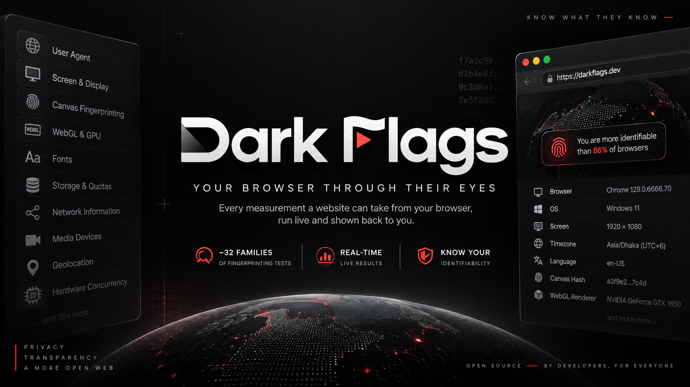

  

# Dark Flags

**Every measurement a website can take from your browser, run live and shown back to you.**

Dark Flags is a client-side browser-fingerprinting bench. It runs ~32 families of fingerprinting and device-enumeration probes against _your own_ browser, shows you the raw values, and estimates how identifiable you are. These are the same signals tracking and anti-fraud scripts collect, surfaced instead of hidden.

📖 **Anonymization guide:** [guide.html](guide.html) (served at `/guide`)

## What it measures

- Navigator core, UA client hints, screen & display, timezone & locale
- Canvas 2D, WebGL / WebGL2, WebGPU, and audio-stack fingerprints
- Installed fonts, media codecs, speech-synthesis voices, media devices
- WebRTC / IP leak, storage & quota, permissions matrix, API-support matrix
- CSS & media features, JS-engine math, timing / compute, keyboard layout, battery
- Automation / bot signals, cookies, a locally-reconstructed tracking pixel, and a fingerprint-resistance check
- Opt-in: public IP intelligence (geo / ASN / VPN detection), behavioral capture, and cross-site login-state

Signals fold into four tiers — hardware, engine × hardware, browser build, and session — plus a headline **estimated identifiability** score.

## Privacy

Every probe runs in your browser and **its results are never uploaded**. What does leave the page, all of it visible in the source: on load, the IP panel asks three public IP-intelligence APIs (ipwho.is, ipapi.is, geojs.io) and two STUN servers (Google, Cloudflare) about your address, network and VPN status, and toggling **Geo** off stops that, including requests still in flight. The login check loads one image from each service it tests, only when you press its button.

### About the identifiability

The headline percentage is an honest **model, not a live-population measurement** — a no-server tool can't compute true rarity against real visitors. It sums published per-signal entropy (Panopticlick, AmIUnique, EFF Cover Your Tracks), counts only what your browser actually exposes (masked canvas / GPU are discounted), applies a correlation discount, and caps at the ~33 bits needed to single out one person among ~8 billion. Treat it as an order-of-magnitude indicator. One honest wrinkle: a browser that blends into a big crowd (Tor Browser at its default size) is _safer_ than its bit-count suggests, because everyone there reports the same values. For numbers measured against a live population, compare with [EFF Cover Your Tracks](https://coveryourtracks.eff.org) and [AmIUnique](https://amiunique.org).

/_ 111005_/

## Files

| File                 | Purpose                                                                      |
| -------------------- | ---------------------------------------------------------------------------- |
| `index.html`         | The app — all probes plus the identifiability estimate, fully self-contained |
| `guide.html`         | Anonymization how-to guide (served at `/guide`)                              |
| `logo.png`           | Primary project logo and wordmark                                            |
| `og.png`             | Open Graph social share card image                                           |
| `_headers`           | Security headers and CSP for Cloudflare Pages                                |
| `tools/server.mjs`   | Local hardened static development server bound to loopback                   |
| `tools/csp-hash.mjs` | CSP SHA-256 inline script hash updater for `_headers`                        |

## Prior art & credit

Inspired by and worth comparing to [EFF Cover Your Tracks](https://coveryourtracks.eff.org), [AmIUnique](https://amiunique.org), Panopticlick, and [browserleaks.com](https://browserleaks.com). Authored by ghost cache.

/_ 111006_/## License

[MIT](LICENSE) © ghost cache
